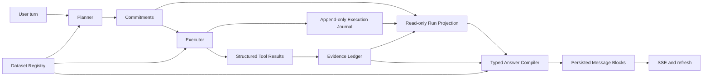

# Data Agent V2 架构设计：事实驱动的分析运行时与纵向交付

- **日期**：2026-08-13
- **状态**：Proposed，待用户与跨模型评审
- **新运行时基座**：`1d570617332103a04a1e944cc7f8be774901a938`
- **功能捐赠源与历史参照**：`e45c1e87c2878fccdceeeb8fb7107cd36d2e1c2d`
- **实施状态**：本文件仅定义架构与交付边界；尚未创建 V2 分支，尚未修改运行时代码

## 1. 决策摘要

Data Agent V2 不在当前 assurance overlay 上继续增加补丁，也不从零重写所有工具和基础设施。V2 采用“选择性归零”：保留成熟的数据读取、统计工具、图表语义、会话和 Web 基础能力，重新设计已经失控的分析编排、运行状态、证据、答案合成和发布链路。

已确认的五项决策如下：

1. 从 `1d57061` 创建独立 V2 重构分支；当前 HEAD 只作为功能与测试捐赠源，不作为新运行时基座。
2. 采用端到端纵向 walking skeleton 交付；每个切片必须对其声明支持的场景实现浏览器端到端可用。
3. 运行状态由 `Planner Commitments + Execution Journal + Evidence Ledger` 只读投影得到，不存在任意 `mark_step_completed` 写路径。
4. 核心承诺达到明确终态即可发布；正向 Finding 不是发布的必要条件，可选图表和增强分析不得阻塞核心答案。
5. 使用 Typed Answer Compiler：既不让模型自由写整篇 Markdown 后再靠正则审计，也不使用僵硬的确定性模板拼接。材料性答案块必须绑定结构化事实，规范数值由服务端控制。

## 2. 产品目标

V2 面向缺少数据科学知识的用户，目标不是展示复杂的分析过程，而是稳定提供：

- 对用户问题和数据语义的正确理解；
- 与数据、分析单位和方法匹配的专业流程；
- 不超过方法和证据上限的结论；
- 必要的统计解释、不确定性和局限；
- 按金字塔原则组织的完整答案；
- 与附近结论语义匹配的图表；
- 由用户意图、证据强度和行动风险共同决定的建议；
- 可理解的实时进度、明确终态和刷新后完整恢复。

V2 的成功标准是“用户可以获得严谨且有用的数据分析”，不是“所有内部 assurance 对象齐全”或“测试数量足够多”。

## 3. 非目标

本设计明确不做以下事情：

- 不兼容旧 plan、requirement、evidence、audit 或 task 内部 schema；
- 不让同一个会话在旧、新运行时之间切换；
- 不批量升级历史证据为 V2 Finding；
- 不把 2026-07-11 会话当作方法正确性的 golden answer；
- 不把所有分析强制转换成固定报告模板；
- 不为每种分析预先构建一个中央要求编译器；
- 不在 V2 第一阶段把自由 `run_python` 输出升级为 verified Finding；
- 不把浏览器传输测试或真实模型调用次数当作产品完成证明；
- 不在第一阶段自动连接仅因列名相同的多文件；
- 不在设计确认前重置、合并或替换当前 `main`。

## 4. 为什么选择 `1d57061`

`1d57061` 是 7 月 18 日 assurance overlay 大规模引入前最后一个源码提交，同时包含 7 月上旬已经有价值的基础能力：

- 文件读取、数据工具和会话基础；
- Web 对话和 SSE 基础设施；
- Golden Answer 质量测量雏形；
- 工作台早期简化；
- 多文件数据理解与关系验证的底层能力；
- 图表语义校验，包括连续数值轴不适合柱状图的约束。

选择该提交不是为了恢复 7 月 11 日的结论，也不是认定它没有缺陷。它仍包含输入锁定、任务面板、手工任务推进、统计方法不充分等问题。选择它的原因是：它提供了较小、较清晰的运行时表面，可以在不保留旧 assurance 兼容层的情况下重建。

当前 HEAD 中以下实现只作为捐赠源：

- raw snapshot 与版本化分析副本；
- frame/candidate fingerprint；
- transformation lineage；
- 结构化因素关系分析；
- Unicode 边界；
- sandbox 有界执行；
- Web session 生命周期修复；
- source digest 和事故回放测试。

捐赠以“提取行为、契约和测试”为原则，不机械 cherry-pick 与旧状态机高度耦合的提交。

## 5. 架构不变量

以下规则是 V2 的承重墙。实现计划和代码评审不得用局部便利破坏它们。

### 5.1 事实写入不变量

1. 原始数据注册后不可修改。
2. 数据转换只能生成新版本，不能覆盖父版本。
3. Planner 只能写分析承诺，不能写完成状态。
4. Executor 只能追加执行事实，不能宣告承诺完成。
5. Evidence Ledger 只能接收可验证的结构化 Finding，不能接收模型自述作为证据。
6. Run Projection 没有持久化写 API；它每次从事实重新计算。
7. Answer Compiler 只能读取事实并生成答案，不能补造 Finding 或修改运行终态。
8. 前端和提示词只能展示或建议，不能成为运行状态权威。

### 5.2 结论不变量

1. 结论强度不得超过执行方法的 `maximum_claim_class`。
2. 相同数值不代表相同指标；指标、单位、方向、范围和数据版本必须匹配。
3. 数据血缘和哈希证明来源身份，不证明统计方法正确。
4. 描述、关联、推断、预测和因果必须明确区分。
5. 缺失、不完整或探索性证据不能静默升级为高置信结论。
6. 单个 Finding 或答案块失败只能影响该块，不得株连整篇答案。
7. 上下文压缩可以减少分析广度，不能增强结论强度。

### 5.3 发布不变量

1. 发布由核心承诺是否达到可解释终态决定，不由字数、短语或工具调用数量决定。
2. “没有显著发现”“数据不足”“方法不可用”都是可发布的有效分析结果。
3. 可选增强失败不能扣留核心答案。
4. 审计负责校准、降级或替换具体答案块，不负责删除整份有用答案。
5. 内部 ID、证据 marker、状态机诊断不得泄露到正常用户答案。
6. `turn_end` 只能在最终消息块持久化完成后发出。

### 5.4 交付不变量

1. 每个实现切片必须有一个真实文件、真实工具和真实浏览器的端到端旅程。
2. 每个切片只宣称支持明确列出的场景，不以局部 PASS 宣称产品整体完成。
3. 新运行时不以旧运行时作为失败回退路径。
4. 旧、新运行时不得同时拥有同一会话的写权限。
5. 未运行、被阻塞和失败必须分别报告，不能计为通过。

## 6. 领域术语

### 6.1 Dataset Version

一次不可变的数据快照。可以是 raw、analysis 或 candidate 角色。每个版本都有父版本、内容指纹和转换血缘。

### 6.2 Commitment

Planner 对本轮分析作出的最小可验证承诺。Commitment 描述用户需要得到什么结果，不描述模型应该调用多少工具。

Commitment 分为：

- `core`：回答用户核心问题所必需；
- `optional`：增强理解但不阻塞核心发布；
- `conditional`：只有数据形态或前置结果命中时才激活。

### 6.3 Execution Event

Executor 追加的不可变运行事实，例如工具开始、成功、失败、用户停止、预算耗尽或等待用户语义输入。

### 6.4 Finding

由结构化工具结果投影出的、可追溯的分析事实。Finding 可以是正向估计、零结果、数据质量诊断、方法诊断或限制，不等于“显著发现”。

### 6.5 Outcome

Run Projection 为每个核心 Commitment 计算出的终态。Outcome 不是模型或工具写入的状态。

### 6.6 Answer Block

Typed Answer Compiler 生成的结构化答案单元。材料性块必须绑定 Finding、数据诊断、用户事实或运行终态。

## 7. 总体架构



架构中真正可写的事实源只有：

1. Dataset Registry；
2. Commitments；
3. Execution Journal；
4. Evidence Ledger；
5. Persisted Message Blocks。

Run Projection 是纯函数投影，不是第六个可写状态库。

## 8. Dataset Registry

### 8.1 最小契约

```text
dataset_version_id
logical_dataset_id
role: raw | analysis | candidate
parent_version_id
source_identity
content_fingerprint
schema_fingerprint
row_count
column_schema
transform_ref
created_at
```

### 8.2 行为

- 文件加载首先注册 raw version；
- 正常分析读取 analysis version；
- 安全解析生成 analysis version，并保留原字段或可逆表示；
- 可能改变结论的操作先生成 candidate version；
- promotion 是幂等操作；
- candidate 的父版本或指纹改变后，旧确认自动失效；
- 数据版本属于会话，不属于任务；任务结束不能释放仍属于会话的数据。

### 8.3 转换决策

转换采用两个独立判断轴：

1. 是否存在用户独占的语义选择；
2. 是否存在外部或不可逆副作用。

| 场景 | 行为 |
|---|---|
| 100% 成功、无信息损失、无语义歧义的日期转换 | 自动执行并记录血缘 |
| 可能改变缺失率或分布但可比较 | 生成 candidate，自动敏感性比较 |
| `01/02/2026` 日期制式不明 | 请求用户语义选择 |
| 多对多连接策略会改变口径 | 请求用户语义选择 |
| 删除、覆盖外部文件或发送结果 | 请求明确授权 |
| 运行回归、预测或因果诊断 | 不因“方法高风险”而请求许可 |

可逆性是重要因素，但不是唯一确认标准。

## 9. Planner 与 Commitment

### 9.1 Planner 的职责

Planner 只负责：

- 理解用户问题、目标指标和分析单位；
- 选择适合的数据版本；
- 生成少量 core、optional 和 conditional Commitments；
- 为每个 Commitment 声明可接受的结果类型和方法族；
- 根据数据形态决定是否需要图表；
- 标记必须由用户提供的语义信息。

Planner 不负责：

- 为每个方法编译庞大的 evidence requirements；
- 指定模型必须按固定顺序调用所有工具；
- 写步骤完成状态；
- 决定最终答案是否发布。

### 9.2 Commitment 最小契约

```text
commitment_id
priority: core | optional | conditional
question
target_semantics
dataset_version_ids
accepted_result_kinds
accepted_method_capabilities
activation_condition
visualization_intent
```

### 9.3 可视化政策

图表是条件式分析产出，不是所有计划的固定步骤。

通常应加入图表的场景：

- 趋势；
- 组间比较；
- 分布；
- 变量关系；
- 异常或模型诊断。

通常可以不画图的场景：

- 单个数值查询；
- 字段或口径解释；
- 没有可靠视觉编码的结果；
- 图表不会增加决策信息的简短诊断。

如果 Commitment 已承诺图表，只有真实 `visual.chart` artifact 才能满足它。其他工具成功不能代替图表产出。

## 10. Executor 与 Execution Journal

### 10.1 Executor 的职责

- 在安全边界内调用工具；
- 将规范化参数、工具版本和数据版本传入工具；
- 记录开始、成功、失败和中断事实；
- 将结构化结果交给 Finding Projector；
- 对声明的等价 fallback 最多执行一次有界恢复；
- 不因证据 bookkeeping 或答案措辞触发重新计算。

### 10.2 Execution Event 最小契约

```text
event_id
run_id
commitment_id
event_type
tool_call_id
tool_name
capability
dataset_version_ids
input_digest
result_ref
error_code
timestamp
```

`event_type` 至少包含：

```text
tool_started
tool_succeeded
tool_failed
fallback_started
user_input_required
user_interrupted
budget_exhausted
system_failed
```

Journal 只追加，不提供 `complete_step` 或 `set_status`。

## 11. ResultContract 与结构化工具

中央 `analysis_requirement.v1` 编译器不进入 V2。每个方法工具通过较小的 ResultContract 声明自身输入、输出和结论边界。

```text
capability
required_inputs
result_schema
assumption_checks
uncertainty_fields
known_limitations
maximum_claim_class
fallback_capability
```

`maximum_claim_class` 使用：

```text
descriptive
associational
inferential
predictive
causal
```

方法特定要求属于工具或方法族。例如：

- 相关工具产出关联强度、有效样本量和缺失处理；
- 回归工具产出估计、标准误、区间、共线性和依赖结构诊断；
- 时间序列工具产出时间范围、频率、自相关或趋势限制；
- 因果工具产出识别设计、处理/对照、重叠和平行趋势等适用诊断。

没有一个中央模块再次解释所有方法的完整要求。

## 12. Evidence Ledger 与 Finding

### 12.1 Finding 最小契约

```text
finding_id
commitment_id
finding_kind
dataset_version_ids
metric_identity
feature_identity
population_scope
time_scope
method_capability
estimate
unit
direction
effective_sample
uncertainty
assumption_results
limitations
maximum_claim_class
computation_ref
verification_level
```

`finding_kind` 至少包括：

```text
estimate
null_result
data_quality
method_diagnostic
limitation
```

### 12.2 写入规则

Finding Projector 只有在以下条件成立时写 Ledger：

- 工具调用成功；
- 输出符合该工具 ResultContract；
- 数据版本和工具输入可解析；
- 指标、单位、范围和方法身份来自服务端或结构化工具结果；
- 工具未声明失败或不适用。

以下内容不能自动写成 verified Finding：

- 模型自然语言自述；
- 失败或截断且无法恢复的工具输出；
- 仅因为数字相同而匹配的结果；
- 缺少数据版本或指标身份的历史记录；
- 自由 `run_python` 输出。

### 12.3 验证等级

V2 保留分层来源概念，但不让等级替代方法判断：

- `traceable`：可追溯到代码、输入和输出；
- `structured_checked`：输出符合 ResultContract；
- `independently_recomputed`：关键结果由独立路径复算。

高验证等级证明结果复现性更强，不自动把 descriptive Finding 提升为 inferential 或 causal。

### 12.4 `run_python`

V2 第一阶段规定：

- `run_python` 是探索和诊断工具；
- 输出可进入 Execution Journal 和 supplemental artifact；
- 默认不得生成 verified Finding；
- 可在答案中作为明确标注的 exploratory 内容；
- 不用它支持高置信推断、预测或因果结论；
- 第一阶段不设计从自由 Python 升级到 bound Finding 的复杂路径。

## 13. 只读 Run Projection

### 13.1 输入

Run Projection 只读取：

- Commitments；
- Execution Journal；
- Evidence Ledger；
- 当前用户输入状态；
- 明确的运行预算和中断事实。

### 13.2 Commitment Outcome

每个 core Commitment 必须投影为以下状态之一：

```text
pending
running
supported
null_result
limited
unavailable
needs_input
interrupted
system_failed
```

其中可发布分析终态是：

```text
supported
null_result
limited
unavailable
```

`needs_input` 表示确实存在用户独占的语义选择；`interrupted` 表示用户主动终止；`system_failed` 表示运行时基础设施故障，必须发布系统诊断而不是伪装成分析结果。

### 13.3 计算规则

- 存在满足 Commitment 的有效 Finding → `supported`；
- 方法完整执行且产生明确零结果 → `null_result`；
- 部分回答可成立但存在无法补足的重要限制 → `limited`；
- 数据或已声明方法无法支持问题，且合理 fallback 也不可用 → `unavailable`；
- 需要用户独占语义选择 → `needs_input`；
- 用户发出停止并被安全处理 → `interrupted`；
- 基础设施无法维持真实状态或持久化 → `system_failed`。

任何单个工具成功都不能直接推导 `supported`。任何字数、短语或模型声明都不能改变 Outcome。

### 13.4 发布条件

正常分析答案可发布，当且仅当：

1. 所有 core Commitments 均达到可发布分析终态；或
2. 已达到当前可获得的最高完整度，剩余 core Commitment 被明确投影为 `limited` 或 `unavailable`。

不要求至少有一个正向 Finding。无显著发现、数据不足和无法识别因果效应都可以成为完整且严谨的最终答案。

Optional Commitment 可以是：

```text
satisfied
skipped_with_reason
failed_nonblocking
```

它们不得阻塞核心发布。

## 14. Typed Answer Compiler

### 14.1 为什么不用自由 Markdown 后审计

旧路径让模型先写整篇答案，再通过 marker、正则、claim extraction 和 EvidenceRecord 事后关联。该方式容易产生：

- 证据 marker 仪式；
- 缺 marker 引发重复执行；
- 数值和语义关联不稳定；
- 审计破坏正文结构；
- 图表刷新关系丢失。

### 14.2 为什么不用纯模板

完全确定性模板难以表达：

- 多 Finding 的综合关系；
- 业务上下文和替代解释；
- 金字塔结构；
- 条件建议；
- 自然、连贯且不过度重复的语言。

### 14.3 编译流程

1. 服务端构建可用 FindingSet、Dataset Diagnostics 和 Run Outcomes。
2. 模型只负责选择、排序、组合和解释这些已给事实。
3. 模型返回结构化 Answer Draft，而不是直接成为最终 Markdown。
4. 每个材料性 Answer Block 声明 `support_refs`。
5. 服务端校验数值、单位、方向、范围和 `claim_class`。
6. 不一致块最多进行一次 synthesis-only 修订；不得调用分析工具补证据仪式。
7. Canonical Renderer 生成最终 Markdown 和持久化消息块。
8. 最终语言润色不得添加新的材料性事实。

### 14.4 Answer Block 类型

```text
executive_answer
key_finding
comparison
chart
method
uncertainty
limitation
recommendation
next_investigation
supplemental
```

材料性块最小契约：

```text
block_id
block_type
support_refs
claim_class
headline
narrative
canonical_values
limitations
chart_refs
```

### 14.5 支撑来源

`support_refs` 可以引用：

- Finding；
- Dataset Diagnostic；
- Commitment Outcome；
- 用户明确提供的业务事实；
- Execution Journal 中的失败或不可用事实。

连接性语言可以不绑定 Finding，但不得引入新数字、新比较、新显著性或新因果断言。

### 14.6 块级校准

每个材料性块应用以下结果之一：

- `supported`：正常渲染；
- `exploratory`：保留并附具体限制；
- `revise`：数值、单位、方向或 claim class 不一致，进行一次结构化修订；
- `replace_with_diagnostic`：无法校准，只替换该块；
- `omit_optional`：仅对可选增强块生效。

不得因为一个块失败删除其他通过的答案块。

## 15. 金字塔结构与建议决策

### 15.1 默认答案结构

V2 默认组织为：

1. 直接回答用户问题；
2. 2–4 个按重要性排序的核心发现；
3. 与发现相邻的证据和图表；
4. 方法与统计不确定性；
5. 条件适用时的建议；
6. 数据和方法局限；
7. 未在正文消费的补充图表或诊断。

不要求每个发现重复“结论、证据、业务含义、限制、下一步”五个小节。

### 15.2 推荐模式

Recommendation 不是所有答案的强制部分。Compiler 根据用户意图、证据、可逆性和行动风险选择：

```text
none
investigative_next_step
operational_action
```

- `none`：用户只要求事实解释，或当前信息不足以给出有价值建议；
- `investigative_next_step`：需要补数据、实验或敏感性分析；
- `operational_action`：用户需要行动建议，且证据与风险允许。

每个 operational action 必须绑定支持 Finding、说明适用条件，并避免把关联误写为干预效果。

## 16. 图表与消息持久化

### 16.1 图表身份

图表是持久化 Artifact 和 Message Block，不是 Markdown 中的路径字符串。

```text
chart_id
artifact_ref
dataset_version_ids
finding_refs
semantic_contract
render_metadata
```

### 16.2 正文与补充区

- Answer Block 通过 `chart_refs` 将图表放在对应结论附近；
- Renderer 记录本轮已消费的 chart IDs；
- 未消费但有效的图表自动进入末尾 supplemental 区；
- 刷新根据持久化消息块恢复，不根据工具文本正则重建；
- 图表 iframe 或组件必须有明确尺寸和加载完成事件。

## 17. SSE、输入和任务展示

### 17.1 SSE 事件

V2 使用语义事件而不是把所有状态塞入 `text_delta`：

```text
turn_started
commentary_delta
commitment_snapshot
tool_started
tool_finished
artifact_ready
outcome_snapshot
final_block_delta
turn_completed
turn_failed
steer_received
```

### 17.2 实时内容边界

- 实时展示服务端约束的工作说明、方法进度和工具事件；
- 不展示原始 chain-of-thought；
- 未校准的材料性结论不能伪装成最终答案；
- 已通过块级校准的最终 Answer Blocks 可以分块流式发布；
- `turn_completed` 只在所有最终块持久化之后发送。

### 17.3 Composer 与停止

- 运行中 textarea 保持可编辑；
- Stop 与 Send/Steer 是独立状态；
- 第一阶段必须实现无确认的一键停止；
- `steer` 协议在 V2 事件模型中预留；是否影响当前运行或排队到安全边界，在后续切片启用；
- 不允许同一会话并发启动两个会修改状态的分析轮次。

### 17.4 任务展示

前端展示 Commitment/Outcome 的只读投影：

- 默认收起；
- 用户手动收起后轮询不得再次展开；
- 采用 overlay/popover，不挤压正文；
- 失败、等待输入和完成状态来自 Run Projection；
- 不把工具调用数量显示成分析完成度。

## 18. Slice 0：验收基线

在编写 V2 运行时代码前先固定验收资产：

- 真实事故回放：56 字过程语、虚假任务完成、无损日期确认、数据生命周期、内联图表、刷新恢复；
- 真实文件和用户问题；
- 独立确定性 oracle；
- 数据分析质量 rubric；
- 人工认可的参考答案结构和方法边界；
- SSE、消息块和浏览器刷新验收协议。

7 月 11 日会话只用于参考图文组织和分析展开，不作为结论正确性的 golden。

## 19. Slice 1：最小完整浏览器旅程

### 19.1 支持范围

Slice 1 只承诺一个单文件描述性场景，不宣称支持完整因素分析、预测或因果分析。

建议场景是一个具有日期和明确数值指标的小型真实 schema fixture，用户提出明确的趋势或分组描述问题。

### 19.2 必须走通的路径

```text
浏览器上传
→ 注册 RawDatasetVersion
→ 创建 AnalysisDatasetVersion
→ Planner 生成 1 个 core Commitment
→ Executor 调用 1 个结构化描述工具
→ Ledger 写入至少一个 Finding 或 null_result
→ Run Projection 计算 Outcome
→ Typed Answer Compiler 生成完整答案块
→ SSE 展示真实进度与最终块
→ 图表按条件生成并显示
→ turn_completed
→ 刷新恢复相同消息块和 Outcome
```

### 19.3 Slice 1 验收

- raw 与 analysis version 指纹和角色正确；
- 不出现旧 plan/evidence/audit marker；
- 任意工具成功不能虚假完成 Commitment；
- 最终答案直接回答问题，并包含方法和局限；
- 如果场景适合图表，图表正文可见且刷新后仍在；
- 如果不适合图表，无图不视为失败；
- 进度在最终答案前可见；
- 最终块在 `turn_completed` 前持久化；
- 浏览器刷新恢复完全一致的消息块；
- 当前切片的 owner、incident 和 browser tests 全部通过。

## 20. 后续纵向切片

### Slice 2：因素关系分析

覆盖“哪些因素是人均确认的显著影响因素”真实场景：

- 目标、特征和分析单位；
- 数学恒等关系与派生指标识别；
- 单变量和多变量分析；
- 时间依赖、共线性和有效样本；
- descriptive、associational 与 inferential 边界；
- 条件图表；
- 无损日期转换自动执行；
- 无正向显著结果时仍能完整发布。

### Slice 3：数据转换与语义确认

- 自动安全转换；
- candidate version；
- 敏感性比较；
- 用户独占语义确认；
- stale candidate rejection；
- lineage 的用户可理解投影。

### Slice 4：方法扩展与建议

- 时间序列；
- 分组比较；
- 预测；
- 推荐分级；
- 多 Finding 综合；
- `run_python` 探索性内容。

### Slice 5：替代、删除与发布

- 扩大真实用户旅程矩阵；
- 删除旧运行时和旧 Gate E/F；
- 冻结 source digest；
- 完成当前主线替换决策；
- 生成新的发布收据和人工语义评审记录。

## 21. 测试体系重建

### 21.1 测试层级

| 层 | 证明什么 | 不证明什么 |
|---|---|---|
| Owner contract | 单一模块不变量和 schema | 用户旅程可用 |
| Incident replay | 已知事故不会复发 | 未覆盖场景质量 |
| Browser journey | 上传、SSE、交互、图表、刷新 | 分析语义一定正确 |
| Real-provider journey | 真实模型能完成特定分析场景 | 整个产品所有场景完成 |
| Human semantic review | 方法、结论、深度和有用性 | 每次运行都确定一致 |

### 21.2 旧 Gate E

删除“Gate E PASS = 产品通过”的名称和聚合语义，保留并拆分为：

- `sse_transport_contract`；
- `browser_interaction_journey`；
- `refresh_persistence_journey`。

### 21.3 旧 Gate F

替换为 `real_provider_analysis_journey`，使用风险不同的真实文件和问题。每个场景记录：

- source、fixture、prompt 和 oracle identity；
- 用户入口；
- 数据版本和 Finding；
- core Outcomes；
- 不应出现的确认；
- 最终消息块和图表；
- 刷新恢复；
- 人工语义评审；
- 首个失败阶段。

真实 provider 运行次数按风险和用户授权确定，不固定重复同一个合成 CSV 三次。

### 21.4 Golden Answer 质量测量

保留两层评价：

- 确定性检查：数值、单位、范围、结论强度、数据关系和必需局限；
- 独立模型软评价：严谨性、洞察深度、数据说明、金字塔结构、建议价值和方向拓展。

软维度分别报告，不用总分掩盖某一维度退化。Baseline 更新必须人工确认。

### 21.5 人工语义评审维度

Real-provider journey 和发布候选必须分别评审以下维度，不能用一个总分互相抵消：

| 维度 | 核心问题 |
|---|---|
| 问题理解 | 是否正确识别用户问题、指标、分析单位和目标量？ |
| 数据范围 | 是否说明数据时间、粒度、样本、缺失和适用总体？ |
| 方法适配 | 方法是否适用于数据生成过程和用户问题？ |
| 统计严谨 | 是否在适用时处理有效样本、效应量、区间、依赖、多重比较和敏感性？ |
| 结论校准 | 是否区分描述、关联、推断、预测和因果？ |
| 替代解释 | 是否识别数学恒等关系、共线性、时间趋势和其他合理解释？ |
| 金字塔表达 | 是否先回答问题，再按重要性组织发现、方法和限制？ |
| 图表价值 | 图表是否支持附近结论，语义、数据和视觉编码是否一致？ |
| 建议质量 | 是否依据用户意图和证据决定是否建议，并说明条件与风险？ |
| 运行完整性 | 上传、进度、答案、图表、终态和刷新是否构成完整旅程？ |
| 稳定性 | 重复运行时核心结论是否保持在可接受范围内？ |

### 21.6 已知事故与设计约束追踪

| 已知事故 | V2 约束 | 主要验收层 |
|---|---|---|
| 56 字过程语被发布为最终答案 | Outcome 只由事实投影；最终 Answer Blocks 持久化后才能 `turn_completed` | incident replay + browser journey |
| 图表未生成但任务全部完成 | 工具成功不能完成 Commitment；真实 chart artifact 才满足图表承诺 | owner contract + incident replay |
| 日期无损转换仍要求确认 | 语义歧义与外部副作用双轴确认；无损无歧义转换自动执行 | incident replay |
| 任务结束后数据不可用 | Dataset Version 属于 session，不属于 task | owner contract + browser refresh |
| 正文内联图表空白 | 图表是持久化 Message Block，具有明确尺寸和加载事件 | browser journey |
| 刷新后图文关系丢失 | 使用 chart IDs 和 message blocks 恢复，不解析工具文本 | refresh persistence journey |
| 任务面板反复展开并挤压正文 | 默认收起、保留用户选择、overlay 展示 | browser interaction journey |
| 模型输出不能实时看到 | 语义 SSE 事件 + 校准后 final block streaming | SSE contract + browser journey |
| 运行中输入被禁用 | textarea 可编辑，Stop 独立，Steer 协议预留 | browser interaction journey |
| 详情文件路径与实际产物不一致 | Journal 和 Artifact 使用规范 ID/ref，不由模型拼文件名 | owner contract + incident replay |
| 同秒 Evidence artifact 覆盖 | 所有事实和 artifact 使用唯一 ID，不使用秒级文件名作为身份 | owner contract |
| sandbox 缺少统计依赖后模型手写替代 | 方法工具声明环境与 fallback；自由 Python 只作 exploratory | owner contract + real-provider journey |
| 一个证据失败导致整篇答案被删除 | 块级校准，不株连其他 Answer Blocks | incident replay + golden quality |
| Gate E/F 假绿 | 验证拆层，活动计数不是 PASS，人工语义维度独立评审 | harness meta-tests |

## 22. 迁移与删除策略

### 22.1 分支策略

- 保留当前 `main@e45c1e8` 不动；
- 从 `1d57061` 创建 V2 分支；
- 当前 HEAD 和历史 worktree 只读参考；
- 设计评审通过前不创建或切换分支；
- 每个切片在 V2 分支内端到端验收；
- 达到替代矩阵后再讨论如何切换主线。

### 22.2 不兼容边界

V2 不读取以下对象作为运行时权威：

- `analysis_requirement.v1`；
- `evidence_record.v2`；
- `final_answer_audit.v1`；
- 旧 task completion；
- 旧 evidence marker；
- 旧 strict/tiered/transparent publication mode；
- 旧 Gate E/F receipt。

历史会话保持只读。用户重新发起分析时，使用原始文件和 V2 运行时重新计算。

### 22.3 捐赠功能审查规则

每项捐赠能力必须分别回答：

1. 它提供的用户价值是什么？
2. 它依赖哪些旧权威或兼容层？
3. 能否只迁移纯算法、schema 或测试？
4. 是否会新增第二写入路径？
5. 是否有当前真实事故覆盖？

不因历史投入、提交数量或测试数量而默认迁移。

## 23. 主要风险与控制

### 23.1 第二系统效应

风险：V2 再次一次性建设完整六层架构，数月后才验证。

控制：严格执行 Slice 0/1；Slice 1 未在浏览器完整通过前，不铺开所有方法。

### 23.2 Typed Answer Compiler 变成新仪式

风险：Answer Block schema 过细，模型再次花费大量 token 满足格式。

控制：块类型保持小而稳定；规范数值服务端注入；模型只组织必要语义；测量 token 与失败率。

### 23.3 ResultContract 分散成重复规则

风险：删除中央编译器后，不同工具重复定义相同统计规则。

控制：共享小型方法族原语，例如 effective sample、interval、dependence diagnostics；不重建全局业务编译器。

### 23.4 可发布终态被滥用

风险：系统把所有失败都包装成 `limited`，看似正常发布。

控制：Outcome 计算有确定性条件；`system_failed` 不得降级为分析限制；事故测试覆盖错误分类。

### 23.5 新旧运行时双权威

风险：为加快迁移而让旧、新系统共同写 session。

控制：一个会话只绑定一个 runtime generation；不提供中途回退；历史只读。

## 24. 被否决的替代方案

### 24.1 在当前 HEAD 修完成度门

否决原因：继续保留多个重叠写权限，只修复当前暴露症状。

### 24.2 从当前 HEAD 长期 strangler

否决原因：旧运行时本身不可作为可靠回退，并会在过渡期形成两套 Planner、Ledger、Completion 和 Publisher 权威。

保留其有价值原则：每个替换切片必须端到端可用。

### 24.3 Big-bang 全量重写

否决原因：几个月没有真实用户结果，复刻 7 月 assurance overlay 的交付错误。

### 24.4 完成所有计划步骤才发布

否决原因：次要图表或增强分析会扣留核心答案，并诱发虚假完成。

### 24.5 至少一个正向 Finding 才发布

否决原因：零结果、数据不足、不可识别和方法失败同样可能是完整且有价值的分析结果。

### 24.6 自由 Markdown + 事后正则审核

否决原因：重新制造 marker、claim extraction 和结构破坏问题。

### 24.7 完全确定性模板

否决原因：无法满足金字塔综合、业务解释和自然表达需要。

## 25. 设计验收标准

本设计进入实现计划前必须满足：

1. 五项已确认决策在文档中有明确、无冲突的落点；
2. 每个可写事实源和只读投影边界清楚；
3. 不存在 `mark_step_completed` 类任意完成写路径；
4. 发布条件覆盖 supported、null、limited 和 unavailable；
5. Typed Answer Compiler 的输入、块类型、校准和渲染边界明确；
6. 图表正文、补充区和刷新关系由持久化 ID 表达；
7. Slice 1 在实现任何全面方法迁移前完成浏览器端到端验收；
8. 旧 HEAD 只作为捐赠源，不形成运行时兼容责任；
9. Gate E/F 的有价值目标被保留，但旧完成语义被删除；
10. 已知六类真实事故均进入 Slice 0 或后续切片验收；
11. 文档明确哪些是既定决策，哪些仍需在实现计划中选择；
12. 用户与评审模型确认后，才创建 V2 分支和实现计划。

## 26. 实现计划阶段仍需确定的细节

以下属于实现选择，不改变本设计原则：

- V2 分支名称与最终主线切换方式；
- Slice 1 的具体 fixture 和 oracle；
- Dataset Registry 的物理持久化格式；
- Execution Journal 的文件或数据库实现；
- Answer Draft 的精确 JSON Schema；
- 哪些现有统计工具可直接迁移，哪些只迁移算法；
- Slice 2 的独立参考分析和人工评审人；
- provider 运行授权次数和成本预算。

## 27. 参考设计

- [`2026-07-18-core-contracts-and-analysis-copy-design.md`](./2026-07-18-core-contracts-and-analysis-copy-design.md)：不可变 raw、版本化副本和转换血缘。
- [`2026-07-27-analysis-execution-and-publication-reliability-design.md`](./2026-07-27-analysis-execution-and-publication-reliability-design.md)：方法上限、claim 级校准和有界恢复的历史来源。
- [`2026-07-28-measurement-identity-and-honest-release-gates-design.md`](./2026-07-28-measurement-identity-and-honest-release-gates-design.md)：测量身份、不株连整篇和诚实验证状态。
- [`2026-07-09-golden-answer-quality-measurement-design.md`](./2026-07-09-golden-answer-quality-measurement-design.md)：确定性与软质量分层测量。
- [`2026-08-11-user-journey-validation-redesign.md`](./2026-08-11-user-journey-validation-redesign.md)：事故回放、浏览器旅程和真实 provider 风险验证。
- [`2026-08-11-assurance-overlay-recovery-design.md`](./2026-08-11-assurance-overlay-recovery-design.md)：当前 overlay 故障链和非破坏性发布经验。

## 28. Slice 5C5B 实施补充：Planner 失败诊断与运行时授权绑定

5C5A 的首次真实规划调用证明了两个共享合同缺口：Planner 合同失败只有异常类名和通用消息，且运行时 authorization 在消费时没有重新绑定实际模型与完整 token 估算。5C5B 按以下边界修复，不放宽 `submit_analysis_plan` 合同，也不增加 repair 或重试：

1. `PlannerContractError` 使用有限枚举 reason code，并明确区分 `provider_response_shape` 与 `plan_compilation`；
2. Provider response 诊断只允许持久化有界结构元数据：`finish_reason`、工具调用数量、工具名、参数类型、参数顶层字段和截断标记；原始文本、reasoning、参数值和 Provider 原始响应不得进入 Plan Ledger；
3. Plan Ledger 持久化 reason code、失败阶段和经过 schema 校验的诊断；HTTP 只返回稳定错误代码、reason code、失败阶段和不含详细诊断的公共 plan 投影；
4. 运行时 authorization fingerprint 绑定 purpose、文件名、数据 fingerprint、问题、planning input、实际 `model_id` 和完整 `planning_context`；消费前必须重新估算并严格相等比较；
5. 实际 Planner 实例的模型必须与消费时估算模型一致，Planner 结果的模型也必须与已授权模型一致；任何漂移都在 Provider 调用前 fail closed；
6. release preflight identity fingerprint 绑定 source digest、场景和发布预检身份；runtime authorization fingerprint 只约束一次运行时 Provider 权限。两者职责不同，不能互相替代。

该补充不构成 `real_provider_analysis_journey` PASS，不授权新的 Provider 调用、`/` 根入口切换、旧系统删除或发布完成声明。

## 29. Slice 5C5D 实施补充：Planner status/payload 共享合同对齐

5C5C 的真实调用在 5C5B 诊断生效后返回单个 `submit_analysis_plan` 工具调用，工具名、arguments 类型和顶层字段均符合 response-shape 合同，但本地 compilation 以 `plan_status_payload_invalid` 拒绝。历史安全证据没有保存参数值，因此不能断言当次具体是哪一个 status/payload 组合；可以确定的是，调用前的 tool JSON Schema 只约束字段类型和独立枚举，没有表达本地编译器对三种 status 的互斥条件。Provider 因而可能产生“对外 schema 接受、本地编译器必拒绝”的 payload。

5C5D 修复共享合同，不增加 repair、重试或放宽本地编译规则：

1. `submit_analysis_plan.parameters` 使用三个互斥 `anyOf` variant：`ready` 必须包含 supported route 且 questions 为空；`needs_input` 必须清空 route 并提出 1–3 个问题；`unsupported` 必须清空 route 和 questions；
2. Planner system contract 明示同一组状态规则；本地 `_compile()` 仍是 fail-closed 权威，Provider schema 不能替代本地语义和列绑定验证；
3. 原 `plan_status_payload_invalid` 保留用于读取历史 Ledger，新增四个稳定原因：`plan_ready_questions_present`、`plan_needs_input_route_present`、`plan_needs_input_questions_missing`、`plan_unsupported_payload_present`；
4. compilation 失败诊断可附加 `recognized_status` 和三个布尔结构标记，只表明 route/questions 是否存在，不保存问题文本、参数值、reasoning 或原始响应；
5. Plan Ledger 仅接受完整的基础诊断字段集，或基础字段集加完整的受控 payload-shape 字段集；HTTP 公共 plan 投影仍不包含详细诊断；
6. 不启用 Provider strict beta、不修改 API base 或模型。DeepSeek 官方文档说明 strict tool schema 需要 beta base 和 `strict=true`；本切片没有对应授权，也不把 schema 引导误称为 Provider 端强制保证。

这次源码变化使 5C5B deterministic evidence、5C5C preflight 和任何更早的 source-bound PASS receipt 对当前源码失效。5C5C attempt 仍是历史失败事实，但不是当前源码 PASS。新的真实调用必须先形成 clean committed source，再重新制作 preflight，并获得新的模型、source digest、目的和精确次数授权。

## 30. Slice 5C5F 实施补充：逐方法参数合同 parity gate

5C5E 证明 status/payload 对齐有效：真实响应进入 `ready` 分支，route 存在且 questions 为空；随后在 `plan_parameter_contract_invalid` 失败。该 reason 同时覆盖缺少必需参数和存在额外参数，而当时诊断没有嵌套参数字段元数据。这说明继续逐次调用只能串行发现下一层合同漂移，不能作为有效测试策略。

5C5F 在再次申请 Provider 授权前完成以下确定性闭环：

1. `ready` 不再使用一个允许任意 parameters 对象的共享 schema，而是按七种自动 analysis kind 生成七个独立 variant；每个 variant 的 required、optional、additionalProperties、类型和值域来自与 compiler 相同的参数合同。列策略、枚举值域、整数范围和布尔类型只有一份服务端定义，schema 与 compiler 共同消费，并以完整字段集合 invariant 防止策略遗漏；
2. schema 绑定当前 DatasetPlanningContext：数值字段、日期字段和可绑定列使用实际列枚举；features 还约束非空、唯一和数值列；
3. compiler 保持独立 fail-closed 校验。schema 是请求侧约束，不是对 Provider 遵循行为的信任替代；
4. 历史 `plan_parameter_contract_invalid` 保留用于读取旧 Ledger；新失败区分 `plan_parameter_fields_missing` 与 `plan_parameter_fields_unexpected`；
5. 受控诊断记录 recognized analysis kind、命中的已知参数字段、缺失的服务端必需字段、对该方法不允许但全局已知的字段、未知字段数量，以及首个值无效的受控字段。未知字段文本和所有参数值仍不持久化；
6. real-provider preflight 升级为 v2，并绑定 `planner_contract_gate`：schema fingerprint、七个 ready variant、九个总状态 variant 和 parity PASS。gate 缺失、失败或计数不符时 validator fail closed；
7. 真实 Provider 不再用于发现基础 schema/compiler 漂移。新的调用申请只能发生在 RED matrix、focused、V2/config、compileall、diff check、clean commit 和新 preflight 全部通过之后。

该补充不增加 repair、隐式重试、原始响应持久化或 Provider 调用。它不构成真实 Provider journey PASS、Gate F、产品完成或根入口切换授权。

## 31. Slice 5C5H 实施补充：跨字段关系与失败 turn 持久化

5C5G 的真实 planning 在一次调用内成功生成 ready plan，但随后确定性执行器拒绝重复的 `group` 与 `analysis_unit` 字段身份。该失败证明单字段 required/type/enum/role 一致仍不足以声明 Planner 与执行器合同闭合。

Planner 共享合同还必须表达执行器的跨字段关系：group comparison 和 multi-finding synthesis 的 metric/group/analysis_unit 互异；factor relationship 的 target 与 analysis_unit 不得进入 features，time_field 不得与 target、analysis_unit 或 features 重合。schema 与 compiler 共同消费一份声明式 relation 定义；schema 按当前数据集列生成 `not` 约束，compiler 继续独立 fail closed，并以 `plan_parameter_relation_invalid` 和受控冲突字段名提供安全诊断。

执行期异常也必须留下 durable terminal state。`/v2/analyze` 在发送 `turn_failed` 前写入空 blocks、status=failed 和受控 request_context，使刷新与独立 GET 能恢复失败；若该持久化自身失败，SSE 只附加异常类型组成的 `persistence_error_code`。

该修复不修改或重放历史 plan，不生成自动 repair，不复用 consumed authorization。5C5G attempt 仍是原 digest 上一次 planning 成功的历史事实；源码变化后必须重新提交、计算 digest 和制作 preflight，才能考虑任何新的真实 Provider 调用。

## 32. Slice 5C5I 实施补充：完整 Planner 请求 token 估算

Provider SDK 的 native `messages+tools` token counter 不能被默认视为完整覆盖 tool schema。5C5I 的实测中，messages 单独为 311 tokens，14,592 字符的当前 tool schema 单独为 4,037 tokens，但 native messages+tools 只返回 348。

PlanningContextBudget 因此使用保守的多分项估算：保留 native 结果作为下限，同时单独计算 messages 与 canonical compact tools JSON，最终取 `max(native, messages + tools)`。任何分项不可计数或返回无效类型都 fail closed。

该数值用于 context-window 安全与 runtime authorization planning_context 绑定，不宣称等同于 Provider 内部不可观察的最终计费 token。历史 5C5G 的 348 估算不完整；虽然没有 context overflow，但对应 preflight 不满足完整 token 身份要求，不能签发 PASS receipt。

## 33. Slice 5C5K 实施补充：Provider-neutral fixture 身份与测试隔离

运行时 authorization 对实际 Planner 模型的严格绑定同样适用于 provider-neutral fixture。fixture Planner 必须显式声明与 planning budget 相同的 `model_id`，不能依赖测试替身缺字段而绕过生产合同。

`build_provider_neutral_fixture()` 会替换配置和 V2 factory，这些是进程级全局状态。每个 fixture 测试必须在结束时恢复原值；组合测试必须在任意文件顺序下保持一致，不能把 pytest 默认排序当作隔离机制。

这两项修复只恢复测试替身与生产合同的 parity，不放宽 authorization，也不生成真实 Provider 证据。

## 34. Slice 5C5L 实施补充：Multi-finding 数据范围合同

5C5J 的真实输出证明方法、区间、效应量和结论校准可用，但人工语义维度中的 `data_scope` 还要求明确说明时间、粒度、样本、缺失和适用总体。仅在 Finding 或内部 ledger 保存这些事实不足以满足发布合同。

multi-finding 的确定性 publisher 因此必须在方法块投影：

1. 时间起止范围、源记录、有效记录、已观测周期、缺失周期和插补周期；
2. 组间比较的有效分析单位、完整记录和剔除记录；
3. 适用总体限于当前上传数据中字段完整、按指定 analysis unit 定义的观察单位，并明确禁止自动外推。

这些内容必须来自结构化分析结果，不由模型自由生成。历史 5C5J 输出仍保持原样且绑定旧 source digest；当前修复不能反向签发 real-provider 或 human-semantic PASS。只有当前源码上的新真实旅程和独立人工逐维评审才能闭合对应发布层。

## 35. Slice 5C5N 实施补充：分析单位语义身份合同

5C5M 的单次真实 planning 和确定性续跑在 transport、持久化与刷新层面完成，但 Planner 把 datetime 角色的 `date` 同时绑定为 `time_field` 和 `analysis_unit`，并在发布内容中把适用总体写成 `analysis_unit:date`。数据集中已经存在 identifier 角色的 `unit_id`。因此该旅程只能记录为历史语义失败，不能签发 real-provider 或 human-semantic PASS。

根因仍位于 Planner 与执行器之间的共享合同，而不是模型输出需要 repair：

1. `analysis_unit` 不再使用“任意列”策略。schema 只公开非 datetime、非 unknown 的候选列，并明确其语义是独立观察实体或聚类单位；compiler 独立执行相同的角色限制，以 `plan_column_binding_invalid` 和受控字段名 fail closed；
2. multi-finding 增加 `time_field/analysis_unit` 互异关系，factor relationship 增加设计文档早已要求但共享关系表遗漏的 `target/analysis_unit` 互异关系；schema 与 compiler 继续共同消费声明式关系定义，关系冲突使用 `plan_parameter_relation_invalid`；
3. 允许 numeric、categorical、identifier 与 text 候选，是因为当前 metadata 只有粗粒度 column role，数值 ID、重复 subject ID 或 UUID 可能分别落入这些角色；本切片只排除能够确定不合法的 datetime/unknown，不用字段名启发式假装已识别所有观察单位；
4. Planner system contract 明确不得把 datetime、metric、grouping 或 time field 绑定为 analysis unit。该引导不替代 schema/compiler 的 fail-closed 校验；
5. 不修改历史 plan，不做自动 repair 或重试。5C5M authorization 已 consumed，历史 attempt 保持原 digest 上的事实，源码修复后任何真实调用都必须重新预检和授权。

本切片的 provider-neutral RED 同时覆盖 observed multi-finding 路由、单独的 group comparison datetime unit，以及 factor target/unit 身份冲突，避免继续用真实 Provider 串行发现本地可穷举的合同缺口。

## 36. Slice 5C5P 实施补充：不完整时间边界周期合同

5C5O 的真实 Planner 已正确选择 `analysis_unit=unit_id`，但同时选择 weekly sum。原始数据覆盖 2026-01-01 至 2026-02-11，形成的首周只有四天、末周只有三天；旧时间序列方法将两个部分周与五个完整周直接回归，把 period bucket 的 2025-12-29 写成数据起点，并发布“未检出可靠趋势”。独立复算证明数值计算与代码一致，但方法输入不可比，因此真实旅程仍不能判 PASS。

时间序列与预测共享的 regular-series 合同必须在推断前识别这一风险：

1. 当输入记录的中位日期间隔小于目标周期长度，说明系统正在把更高频记录聚合到 weekly/monthly；此时观察窗口必须覆盖完整首尾日历周期；
2. 对 weekly 使用 Monday-Sunday，对 monthly 使用自然月边界。首尾落在同一周期时只计一次；原生周频或月频数据保持原周期语义，不因只有一个周期标签记录而误判为部分周期；
3. 任一不完整边界周期产生稳定 `incomplete_boundary_periods`，trend 和 forecast 都 fail closed，不删除边界、不补零、不插值，也不发布趋势系数或未来点预测；
4. `TimeSeriesResult`、`ForecastResult`、Finding 和方法块投影不完整边界周期数量。时间范围使用真实有效记录的最小/最大时间，不再把 period bucket 起点冒充数据覆盖起点；
5. multi-finding 可继续发布独立且可靠的 group comparison，但 executive 与趋势块必须明确趋势受数据条件限制，不能让组间结论掩盖时间方法限制。

该修复不改变 Planner 输出、不自动改成 daily、不重放 consumed plan，也不新增 Provider 调用或隐式 repair。5C5O attempt 是旧 digest 上一次有效调用和语义失败的历史事实；源码变化后所有旧 source-bound receipts 失效。

## 37. Slice 5C5S 实施补充：同 digest 真实 Planner 最小重复性

稳定性证据本身也受 source digest 约束。若为了编排稳定性试验新增 `src/`、`scripts/` 或 `tests/` 代码，现有真实 Provider baseline 会立刻 stale，原定的“一个 current baseline 加两个追加样本”就不能成立。因此在单次 Provider 调用、安全诊断、runtime authorization 绑定和 preflight validator 已经具备的前提下，5C5S 使用 docs-only 协议编排，不新增 pooled authorization 层，也不改变源码身份。

重复性协议遵守以下合同：

1. baseline 与追加样本必须共享 release preflight identity：source digest、场景、fixture、数据 fingerprint、问题、模型、完整 planning context 和 Planner schema；
2. 两个追加 trial 分别消费一份恰好 1 次的 runtime authorization。第二份只能在第一轮 PASS 后签发，不能预先创建可消费两次的 blanket authorization；
3. 每次消费前重新计算实际模型和完整 planning context，并与该次 authorization 严格比较；各 trial 的 authorization、client action 和 consumer request identity 必须唯一；
4. Provider、Planner、needs-input、unsupported、normalized plan identity、确定性续跑或独立复算任一失败都立即停止，不重试、不 repair、不补跑；
5. 三样本 PASS 只支持“同一冻结输入上的最小重复性”结论，不等同于总体 Provider 可靠率、其他场景能力、human semantic review 或产品发布完成；
6. release preflight identity fingerprint、runtime authorization fingerprint 和 plan identity fingerprint 分别绑定发布输入、单次运行权限与规范化计划语义，三者不能互相替代。

该协议不调用 Provider、不签发 authorization、不改变现有真实 Provider receipt，也不授权根入口切换、旧系统删除、push 或 merge。
